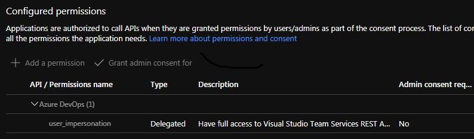
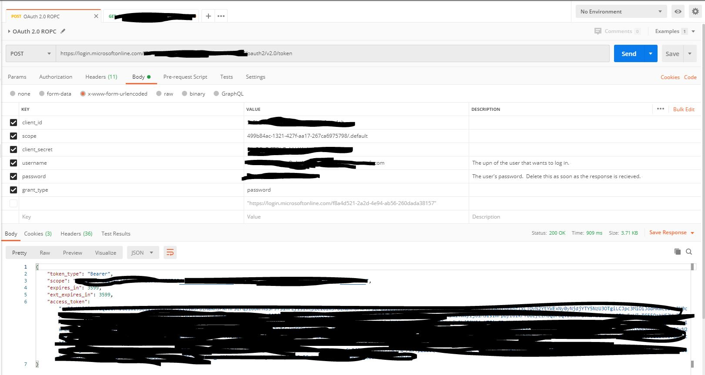
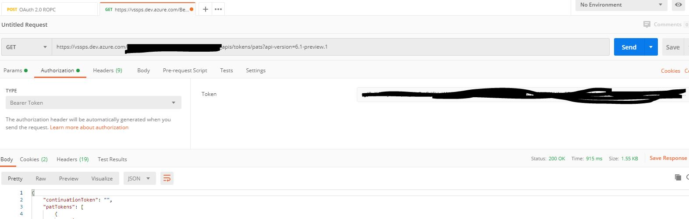

# Recommended alternative way use an SP!

In 2023 new ways have been added to connect to Azure DevOps - you should check my [newer repo AzureDevOpsPatWithServicePrincipal](https://github.com/Bjego/AzureDevOpsPatWithServicePrincipal).

If you still want to use the service account - here you go!


<hr>


# Automated Azure DevOps PAT management using a technical user - with no interaction from postman and nodejs
## What should be archived ?
We are looking to use the new APIs announced [here](https://devblogs.microsoft.com/devops/personal-access-token-lifecycle-apis-now-publicly-available/) to manage PATs from technical users to e.g. rotate the PATs from our selfhosted Agents in Kubernetes, or to connect 3rd party software like SonarQube.
## Which API can I use?
In Q1 2021 Microsoft released the token API which is capable to manage PATs for users: https://docs.microsoft.com/en-us/rest/api/azure/devops/tokens/pats?view=azure-devops-rest-6.1

## Which Flow do I have to use?
To manage tokens of your technical users in an non interactive way, you can use the username/password flow. As this flow works with no interaction. 

You can also have a look at the flask app provided by the Azure DevOps team to manage PATs in an interactive way. [See the MS tutorial.](https://docs.microsoft.com/en-gb/azure/devops/organizations/accounts/manage-personal-access-tokens-via-api?view=azure-devops).

## What do I have to prepare?

- As listed in the docs from the interactive flow. First create an application in your Azure AD. [See it here](https://docs.microsoft.com/en-gb/azure/devops/organizations/accounts/manage-personal-access-tokens-via-api?view=azure-devops#example-get-started-with-a-python-flask-quickstart-application).
    And give it the grant:
    

    Now you need to note down:
    - Application (client) ID as client_id
    - Directory (tenant) ID as tenant
    - The client secret as client_secret

- Create an "technical user" in Azure AD and allow it to login with Username and Password flow. [See the docs here.](https://docs.microsoft.com/en-us/azure/active-directory/fundamentals/add-users-azure-active-directory) If you are an administrator of your Azure tenant you need to allow Username and Password authentication for this user. So in our organisation only a few people are allowed to manage this content. So I can't give you more insights here, [except of this doucmentation](https://docs.microsoft.com/en-us/azure/active-directory/develop/msal-authentication-flows#usernamepassword).
    Here you have to note the following:
    - User Principal Name (E-Mail) as username
    - Password as password

- Add you technical user to Azure DevOps and put it into the required groups - where you need a PAT for automation for. [How to add a user to Azure DevOps](https://docs.microsoft.com/en-us/azure/devops/organizations/accounts/add-organization-users?view=azure-devops&tabs=preview-page). I've used the interactive login for this user a couple of times, so I'm not sure if you need to login at least once. I did it :)

# Let's get started with Postman
## Get an AAD Token for your technical user
[So here are the official docs, you can easily run them in your local postman](https://docs.microsoft.com/en-gb/azure/active-directory/develop/v2-oauth-ropc)
You have to configure it like this:
```
POST - https://login.microsoftonline.com/TENANT/oauth2/v2.0/token
BODY -
x-www-form-urlencoded
```

| key           | value                                         | comment                                              |
| ------------- | --------------------------------------------- | ---------------------------------------------------- |
| client_id     | your client_id                                |                                                      |
| scope         | 499b84ac-1321-427f-aa17-267ca6975798/.default | This is hardcoded for the azure devops impersonation |
| client_secret | your client_secret                            |                                                      |
| username      | your username from the technical user         |                                                      |
| password      | your password from the technical user         |                                                      |
| grant_type    | password                                      | hard coded for this flow                             |



## Using the API of Azure DevOps
I'll demonstrate the list call, [as documented here](https://docs.microsoft.com/en-us/rest/api/azure/devops/tokens/pats/list?view=azure-devops-rest-6.1).
You have to configure postman like this:
```
GET - https://vssps.dev.azure.com/YOUR_ORGANISATION/_apis/tokens/pats?api-version=6.1-preview.1
Authorisation - Bearer Token - The token from the response earlier
```


## PAT scopes not mentioned in the API docs
All the pat scopes are listed here [Azure DevOps Scope List](https://docs.microsoft.com/en-us/azure/devops/extend/develop/manifest?view=azure-devops#scopes)
I've used an excel sheet to create all the scopes in the enum. With substitute function.

# Now moving over to typescript / nodejs
## Environment
How to configure your environment. This code is configured entirely by environment variables, as it is supposed in automated kubernetes cron jobs in production.
Environment Variables
| key                 | value      | kind     |
| ------------------- | ---------- | -------- |
| AZURE_TENANT_ID     | XXXXX      | Required |
| AZURE_DEVOPS_ORG    | YYYYYYY    | Required |
| AZURE_CLIENT_SECRET | ZZZZZZ     | Required |
| AZURE_CLIENT_ID     | TTTTTTTT   | Required |
| HTTPS_PROXY         | MYPROXYURL | Optional |
| HTTP_PROXY          | MYPROXYURL | Optional |
## Helper for fetch to handle our corporate proxy
```
//Inspired by https://github.com/snoguchi/node-fetch-with-proxy
import { Response } from 'node-fetch';
import fetch from 'node-fetch';
import ProxyAgent from 'proxy-agent';
function fetchWrapper(url: string, options: any): Promise<Response> {
  const proxy = process.env.HTTP_PROXY || process.env.HTTP_PROXY;
  if (proxy) {
    const proxyAgent = new ProxyAgent(proxy);
    options.agent = proxyAgent;
    return fetch(url, options);

  } else {
    return fetch(url, options);
  }
}

export default fetchWrapper;
```
## Loading the configuration object
We will use a configuration class here. It's loading the required information from the environment
```typescript
interface Azure {
  Tenant: string,
  Client: string,
  Secret: string,
  Username: string,
  Password: string
}
class Configuration {
  azure: Azure;
  organisation: string;
  constructor() {
    this.azure = {
      Tenant: '',
      Client: '',
      Secret: '',
      Username: '',
      Password: ''
    };

    this.organisation = ''
  }
  loadFromEnv() {
    console.log("Loading configuration from Environment...");
    this.azure.Client = this.validate('process.env.AZURE_CLIENT_ID', process.env.AZURE_CLIENT_ID);
    this.azure.Tenant = this.validate('process.env.AZURE_TENANT_ID', process.env.AZURE_TENANT_ID);
    this.azure.Secret = this.validate('process.env.AZURE_CLIENT_SECRET', process.env.AZURE_CLIENT_SECRET);
    this.azure.Username = this.validate('process.env.AZURE_USERNAME', process.env.AZURE_USERNAME);
    this.azure.Password = this.validate('process.env.AZURE_PASSWORD', process.env.AZURE_PASSWORD);

    this.organisation = this.validate('process.env.AZURE_DEVOPS_ORG', process.env.AZURE_DEVOPS_ORG);
  }
  validate(name: string, variable: string) {
    if (!variable) {
      throw `Environment variable expected : ${name}`;
    }
    return variable;
  }
}
export default Configuration;
```
## Getting the required Azure AD Token
```typescript
import fetch from './fetchwrapper';
import { URLSearchParams } from 'url';
import Configuration from './configuration';

class AzureAdClient {
  configuration: Configuration;
  url: string;
  validUntil: Date;
  token: string;
  constructor(configuration) {
    this.configuration = configuration;
    this.url = `https://login.microsoftonline.com/${this.configuration.azure.Tenant}/oauth2/v2.0/token`;
    this.validUntil = null;
    this.token = null;
  }
  async getTokenAsync() {
    console.log('Getting azure ad token');
    if (this.token && this.validUntil > new Date()) {
      console.log('Using existing azure ad token');
      return this.token
    }
    console.log('Requesting a new azure ad token');
    const config = this.buildConfig();
    const requestTime = new Date();
    const response = await fetch(this.url, { method: 'POST', body: config })
    const json = await response.json();

    const token = json.access_token;
    const expiresInMilliSecs = json.expires_in * 1000;
    this.validUntil = new Date(requestTime.getTime() + expiresInMilliSecs);
    this.token = token;
    console.log('Using a new token');
    return this.token;
  }
  buildConfig() {
    const params = new URLSearchParams();
    params.append('client_id', this.configuration.azure.Client);
    params.append('scope', "499b84ac-1321-427f-aa17-267ca6975798/.default");
    params.append('client_secret', this.configuration.azure.Secret);
    params.append('username', this.configuration.azure.Username);
    params.append('password', this.configuration.azure.Password);
    params.append('grant_type', 'password');
    return params;
  }
}

export default AzureAdClient;
```
## Bringing it all together in an Azure DevopsClient
```typescript
import fetch from './fetchwrapper';
import AzureAdClient from './azureAdClient';
import Configuration from './configuration';
import { ListResponse } from './AzureDevopsApiObjects/ListResponse';
import { CreatePatRequest } from './AzureDevopsApiObjects/CreatePatRequest';
import { PatDetailResponse } from './AzureDevopsApiObjects/PatDetailResponse';
import { UpdatePatRequest } from './AzureDevopsApiObjects/UpdatePatRequest';


class azureDevOpsApi {
  configuration: Configuration;
  tokenLoader: AzureAdClient;
  listUrl: string;
  createUrl: string;
  deleteUrl: string;
  updateUrl: string;
  getUrl: string;
  constructor(configuration: Configuration) {
    this.configuration = configuration;
    this.tokenLoader = new AzureAdClient(configuration);
    this.listUrl = `https://vssps.dev.azure.com/${this.configuration.organisation}/_apis/tokens/pats?api-version=6.1-preview.1`;
    this.createUrl = `https://vssps.dev.azure.com/${this.configuration.organisation}/_apis/tokens/pats?api-version=6.1-preview.1`;
    this.deleteUrl = `https://vssps.dev.azure.com/${this.configuration.organisation}/_apis/tokens/pats?api-version=6.1-preview.1&authorizationId=`;
    this.updateUrl = `https://vssps.dev.azure.com/${this.configuration.organisation}/_apis/tokens/pats?api-version=6.1-preview.1`;
    this.getUrl = `https://vssps.dev.azure.com/${this.configuration.organisation}/_apis/tokens/pats?api-version=6.1-preview.1&authorizationId=`;
  }
  async listPatsAsync(): Promise<ListResponse> {
    console.log('Getting all Pats');
    const options = await this.buildHeaders();
    const response = await fetch(this.listUrl, options);
    const json = await response.json();
    return json as ListResponse;
  }

  async createPatAsync(createRequest: CreatePatRequest): Promise<PatDetailResponse> {
    const options = await this.buildHeaders();
    options.method = 'POST';
    options.body = JSON.stringify(createRequest);
    const response = await fetch(this.createUrl, options);
    const json = await response.json();
    return json as PatDetailResponse;
  }

  async getPatAsync(authorizationId: string): Promise<PatDetailResponse> {
    console.log(`Loading token: ${authorizationId}`);
    const url = `${this.getUrl}${authorizationId}`;
    const options = await this.buildHeaders();
    const response = await fetch(url, options);
    const json = await response.json();
    return json as PatDetailResponse;
  }

  async revokePatAsync(authorizationId: string): Promise<Boolean> {
    console.log(`Revoking token: ${authorizationId}`);
    const url = `${this.deleteUrl}${authorizationId}`;
    const options = await this.buildHeaders();
    options.method = 'DELETE';
    const response = await fetch(url, options);
    return response.ok
  }

  async updatePatAsync(updatePatRequest: UpdatePatRequest) {
    const options = await this.buildHeaders();
    options.method = 'PUT';
    options.body = JSON.stringify(updatePatRequest);
    const response = await fetch(this.createUrl, options);
    const json = await response.json();
    return json as PatDetailResponse;
  }


  async buildHeaders(): Promise<any> {
    return {
      headers: {
        'Authorization': `Bearer ${await this.tokenLoader.getTokenAsync()}`,
        'Content-Type': 'application/json'
      }
    }
  }
}

export default azureDevOpsApi;
```
### Responses and Request objects
Those have been created from the docs - [here](https://docs.microsoft.com/en-us/rest/api/azure/devops/tokens/pats?view=azure-devops-rest-6.1)
The scopes aren't documented in that place, you can find them in [this documentation](https://docs.microsoft.com/en-us/azure/devops/extend/develop/manifest?view=azure-devops#scopes)

## Let's use node to create a Pat Token
```typescript
import azureDevOpsApi from "./azuredevopsClient";
import { Scope } from "./AzureDevopsApiObjects/Scope";
import Configuration from "./configuration";

async function main() {
  const configuration = new Configuration();
  configuration.loadFromEnv();
  const azureDevopsClient = new azureDevOpsApi(configuration);
  const pats = await azureDevopsClient.listPatsAsync();
  console.log(pats);
  const createdPat = await azureDevopsClient.createPatAsync({
    allOrgs: true,
    displayName: 'A test pat',
    scope: Scope.Code__full,
    validTo: new Date(Date.now() + HoursToMiliseconds(2)).toISOString()
  });
  console.log(createdPat);

  const detailsOfPat = await azureDevopsClient.getPatAsync(createdPat.patToken.authorizationId);
  console.log(detailsOfPat);

  const updatedPat = await azureDevopsClient.updatePatAsync({
    allOrgs: true,
    authorizationId: createdPat.patToken.authorizationId,
    displayName: 'An updated pat',
    scope: Scope.FullAccess,
    validTo: new Date(Date.now() + HoursToMiliseconds(12)).toISOString(),
  });
  console.log(updatedPat);

  const deletePat = await azureDevopsClient.revokePatAsync(createdPat.patToken.authorizationId);
  console.log(`Pat has been deleted: ${deletePat}`);
}


main()
  .catch(err => console.log(err, true))
  .then(_ => process.exit());

function HoursToMiliseconds(hours: number): number {
  return 2 * 60 * 60 * 1000;
}

```

# Summary
Great isn't it? We will use this api to manage our required pats now via cron jobs in our kubernetes environment.
